# Add a feature

*Canonical workflow id: `add-feature`*

Source of truth: [`workflow.yaml`](workflow.yaml) (schema `guild.workflow/v1`).
See [`../EXECUTION_MODES.md`](../EXECUTION_MODES.md) for how this definition maps to a single
assistant switching roles, native subagents, or a future external runtime.

## Description

Implement a new, prioritized product feature from requirements through optional deployment.

## Diagram

Diamond-shaped nodes are optional/conditional steps; see the step table for their condition.

```mermaid
flowchart TD
    add-feature-01-triage["DM — Triage the feature request"]
    add-feature-02-define-requirements["Fighter — Define requirements"]
    add-feature-03-design-experience{{"Druid — Design the experience"}}
    add-feature-04-write-copy{{"Bard — Write interface copy"}}
    add-feature-05-implement-backend{{"Artificer — Implement backend/domain logic"}}
    add-feature-06-implement-frontend{{"Ranger — Implement the web experience"}}
    add-feature-07-maintain-component-catalog{{"Ranger — Maintain the component catalog"}}
    add-feature-08-review-schema{{"Wizard — Review the schema change"}}
    add-feature-09-implement-integration{{"Warlock — Implement the integration"}}
    add-feature-10-instrument-analytics{{"Monk — Instrument analytics"}}
    add-feature-11-regression-review["Barbarian — Run the regression review"]
    add-feature-12-threat-model{{"Rogue — Review security impact"}}
    add-feature-13-prepare-pull-request["Artificer — Prepare the pull request"]
    add-feature-14-human-approval-merge{{"Human — Approve merge to a protected branch"}}
    add-feature-15-human-approval-deploy{{"Human — Approve production deployment"}}
    add-feature-16-deploy{{"Cleric — Deploy the change"}}
    add-feature-17-consolidate-knowledge{{"DM — Consolidate knowledge"}}
    add-feature-01-triage --> add-feature-02-define-requirements
    add-feature-02-define-requirements --> add-feature-03-design-experience
    add-feature-03-design-experience --> add-feature-04-write-copy
    add-feature-04-write-copy --> add-feature-05-implement-backend
    add-feature-05-implement-backend --> add-feature-06-implement-frontend
    add-feature-06-implement-frontend --> add-feature-07-maintain-component-catalog
    add-feature-07-maintain-component-catalog --> add-feature-08-review-schema
    add-feature-08-review-schema --> add-feature-09-implement-integration
    add-feature-09-implement-integration --> add-feature-10-instrument-analytics
    add-feature-10-instrument-analytics --> add-feature-11-regression-review
    add-feature-11-regression-review --> add-feature-12-threat-model
    add-feature-12-threat-model --> add-feature-13-prepare-pull-request
    add-feature-13-prepare-pull-request --> add-feature-14-human-approval-merge
    add-feature-14-human-approval-merge --> add-feature-15-human-approval-deploy
    add-feature-15-human-approval-deploy --> add-feature-16-deploy
    add-feature-16-deploy --> add-feature-17-consolidate-knowledge
```

## Steps

| Step id | Name | Responsible profile | Invoked skill | Gates |
|---|---|---|---|---|
| `add-feature-01-triage` | Triage the feature request | **DM** (`workflow-knowledge-orchestrator`) | `triage-request` | — |
| `add-feature-02-define-requirements` | Define requirements | **Fighter** (`business-analyst`) | `define-requirements` | — |
| `add-feature-03-design-experience` | Design the experience *(optional — when the feature has a user-facing interface)* | **Druid** (`product-experience-designer`) | `design-experience` | — |
| `add-feature-04-write-copy` | Write interface copy *(optional — when the feature has a user-facing interface)* | **Bard** (`ux-content-designer`) | `write-interface-copy` | — |
| `add-feature-05-implement-backend` | Implement backend/domain logic *(optional — when the feature touches domain logic, application flow or an API)* | **Artificer** (`product-software-engineer`) | `implement-feature` | — |
| `add-feature-06-implement-frontend` | Implement the web experience *(optional — when the feature is primarily a web-experience/frontend change)* | **Ranger** (`web-experience-engineer`) | `implement-feature` | — |
| `add-feature-07-maintain-component-catalog` | Maintain the component catalog *(optional — when the interface includes reusable UI components worth developing, reviewing or visually verifying independently of the full application)* | **Ranger** (`web-experience-engineer`) | `maintain-component-catalog` | — |
| `add-feature-08-review-schema` | Review the schema change *(optional — when the feature touches the database schema)* | **Wizard** (`database-engineer`) | `review-schema-change` | — |
| `add-feature-09-implement-integration` | Implement the integration *(optional — when the feature touches an external integration)* | **Warlock** (`integration-engineer`) | `implement-integration` | — |
| `add-feature-10-instrument-analytics` | Instrument analytics *(optional — when the feature requires new analytics events)* | **Monk** (`data-analytics-engineer`) | `instrument-analytics` | — |
| `add-feature-11-regression-review` | Run the regression review | **Barbarian** (`quality-assurance-engineer`) | `run-regression-review` | qa_gate_pass |
| `add-feature-12-threat-model` | Review security impact *(optional — when the feature touches authentication, authorization, secrets, payments or personal data)* | **Rogue** (`product-security-engineer`) | `create-threat-model` | security_gate_clean |
| `add-feature-13-prepare-pull-request` | Prepare the pull request | **Artificer** (`product-software-engineer`) | `prepare-pull-request` | — |
| `add-feature-14-human-approval-merge` | Approve merge to a protected branch *(optional — when the target branch is protected)* | **Human** | `grant-human-approval` | merge_protected_branch |
| `add-feature-15-human-approval-deploy` | Approve production deployment *(optional — when this workflow includes a production deployment)* | **Human** | `grant-human-approval` | deploy_production |
| `add-feature-16-deploy` | Deploy the change *(optional — when this workflow includes a deployment)* | **Cleric** (`cloud-devops-engineer`) | `plan-and-execute-deployment` | — |
| `add-feature-17-consolidate-knowledge` | Consolidate knowledge *(optional — when the feature produced a reusable pattern or decision worth recording)* | **DM** (`workflow-knowledge-orchestrator`) | `consolidate-knowledge` | — |

## Failure paths

- A failing regression review by the Barbarian returns to the implementing profile — Artificer, Ranger, Wizard, Warlock or Monk — rather than proceeding to review or deployment.
- An open critical/high finding raised by the Rogue blocks pull-request preparation until resolved and re-reviewed.

## Return paths

- An ambiguous or incomplete requirement returns to the Fighter (business-analyst) before implementation continues.

## Escalation paths

- Merging to a protected branch and any production deployment always escalate to the human, asked by the DM in the approval-request format and naming the profile blocked on the answer.
