# Create a new project

*Canonical workflow id: `create-new-project`*

Source of truth: [`workflow.yaml`](workflow.yaml) (schema `guild.workflow/v1`).
See [`../EXECUTION_MODES.md`](../EXECUTION_MODES.md) for how this definition maps to a single
assistant switching roles, native subagents, or a future external runtime.

## Description

Bootstrap a brand-new project under Guild governance, from vision through an initial, verified, optionally-deployed skeleton.

## Diagram

Diamond-shaped nodes are optional/conditional steps; see the step table for their condition.

```mermaid
flowchart TD
    new-project-01-triage["DM — Triage the new-project request"]
    new-project-02-define-vision["Paladin — Define the product vision"]
    new-project-03-define-requirements["Fighter — Define initial requirements"]
    new-project-04-design-experience{{"Druid — Design the initial experience"}}
    new-project-05-write-copy{{"Bard — Write initial interface copy"}}
    new-project-06-scaffold-project["Artificer — Scaffold the project skeleton"]
    new-project-07-maintain-component-catalog{{"Ranger — Maintain the component catalog"}}
    new-project-08-review-schema{{"Wizard — Review the initial schema"}}
    new-project-09-implement-integration{{"Warlock — Implement the initial integration"}}
    new-project-10-baseline-threat-model{{"Rogue — Assess baseline security posture"}}
    new-project-11-regression-review["Barbarian — Verify the scaffold"]
    new-project-12-prepare-pull-request["Artificer — Prepare the initial pull request"]
    new-project-13-human-approval-provision{{"Human — Approve production provisioning"}}
    new-project-14-initial-deployment{{"Cleric — Deploy the initial environment"}}
    new-project-15-consolidate-knowledge["DM — Consolidate initial project knowledge"]
    new-project-01-triage --> new-project-02-define-vision
    new-project-02-define-vision --> new-project-03-define-requirements
    new-project-03-define-requirements --> new-project-04-design-experience
    new-project-04-design-experience --> new-project-05-write-copy
    new-project-05-write-copy --> new-project-06-scaffold-project
    new-project-06-scaffold-project --> new-project-07-maintain-component-catalog
    new-project-07-maintain-component-catalog --> new-project-08-review-schema
    new-project-08-review-schema --> new-project-09-implement-integration
    new-project-09-implement-integration --> new-project-10-baseline-threat-model
    new-project-10-baseline-threat-model --> new-project-11-regression-review
    new-project-11-regression-review --> new-project-12-prepare-pull-request
    new-project-12-prepare-pull-request --> new-project-13-human-approval-provision
    new-project-13-human-approval-provision --> new-project-14-initial-deployment
    new-project-14-initial-deployment --> new-project-15-consolidate-knowledge
```

## Steps

| Step id | Name | Responsible profile | Invoked skill | Gates |
|---|---|---|---|---|
| `new-project-01-triage` | Triage the new-project request | **DM** (`workflow-knowledge-orchestrator`) | `triage-request` | — |
| `new-project-02-define-vision` | Define the product vision | **Paladin** (`product-owner`) | `define-product-vision` | — |
| `new-project-03-define-requirements` | Define initial requirements | **Fighter** (`business-analyst`) | `define-requirements` | — |
| `new-project-04-design-experience` | Design the initial experience *(optional — when the new project has a user-facing interface)* | **Druid** (`product-experience-designer`) | `design-experience` | — |
| `new-project-05-write-copy` | Write initial interface copy *(optional — when the new project has a user-facing interface)* | **Bard** (`ux-content-designer`) | `write-interface-copy` | — |
| `new-project-06-scaffold-project` | Scaffold the project skeleton | **Artificer** (`product-software-engineer`) | `implement-feature` | — |
| `new-project-07-maintain-component-catalog` | Maintain the component catalog *(optional — when the interface includes reusable UI components worth developing, reviewing or visually verifying independently of the full application)* | **Ranger** (`web-experience-engineer`) | `maintain-component-catalog` | — |
| `new-project-08-review-schema` | Review the initial schema *(optional — when the new project requires a persistent data store)* | **Wizard** (`database-engineer`) | `review-schema-change` | — |
| `new-project-09-implement-integration` | Implement the initial integration *(optional — when the new project requires an external API/service integration from day one)* | **Warlock** (`integration-engineer`) | `implement-integration` | — |
| `new-project-10-baseline-threat-model` | Assess baseline security posture *(optional — when the project will handle authentication, payments, secrets or personal data)* | **Rogue** (`product-security-engineer`) | `create-threat-model` | — |
| `new-project-11-regression-review` | Verify the scaffold | **Barbarian** (`quality-assurance-engineer`) | `run-regression-review` | qa_gate_pass |
| `new-project-12-prepare-pull-request` | Prepare the initial pull request | **Artificer** (`product-software-engineer`) | `prepare-pull-request` | — |
| `new-project-13-human-approval-provision` | Approve production provisioning *(optional — when this workflow provisions production infrastructure or deploys the new project to production)* | **Human** | `grant-human-approval` | deploy_production, provision_material_cost |
| `new-project-14-initial-deployment` | Deploy the initial environment *(optional — when this workflow includes provisioning a live environment)* | **Cleric** (`cloud-devops-engineer`) | `plan-and-execute-deployment` | — |
| `new-project-15-consolidate-knowledge` | Consolidate initial project knowledge | **DM** (`workflow-knowledge-orchestrator`) | `consolidate-knowledge` | — |

## Failure paths

- If the scaffold fails verification, the workflow returns to scaffolding rather than proceeding to deployment.
- If a required human approval is denied, the workflow stops before the gated action and the DM records why, naming the profile that stays blocked.

## Return paths

- A requirement built on an undocumented assumption returns to the Paladin for vision or the Fighter for requirements definition.

## Escalation paths

- Any production provisioning or deployment escalates to the human before execution, asked by the DM on the Cleric's behalf.
