# Create a new project

*Canonical workflow id: `create-new-project`*

Source of truth: [`workflow.yaml`](workflow.yaml) (schema `guild.workflow/v1`).
See [`../EXECUTION_MODES.md`](../EXECUTION_MODES.md) for how this definition maps to a single
assistant switching roles, native subagents, or a future external runtime.

## Description

Bootstrap a brand-new project under Guild governance, from vision through an initial, verified, optionally-deployed skeleton.

## Diagram

Diamond-shaped nodes are optional/conditional steps; see the step table for their condition.

```mermaid
flowchart TD
    new-project-01-triage["Triage the new-project request"]
    new-project-02-define-vision["Define the product vision"]
    new-project-03-define-requirements["Define initial requirements"]
    new-project-04-design-experience{{"Design the initial experience"}}
    new-project-05-write-copy{{"Write initial interface copy"}}
    new-project-06-scaffold-project["Scaffold the project skeleton"]
    new-project-07-review-schema{{"Review the initial schema"}}
    new-project-08-implement-integration{{"Implement the initial integration"}}
    new-project-09-baseline-threat-model{{"Assess baseline security posture"}}
    new-project-10-regression-review["Verify the scaffold"]
    new-project-11-prepare-pull-request["Prepare the initial pull request"]
    new-project-12-human-approval-provision{{"Approve production provisioning"}}
    new-project-13-initial-deployment{{"Deploy the initial environment"}}
    new-project-14-consolidate-knowledge["Consolidate initial project knowledge"]
    new-project-01-triage --> new-project-02-define-vision
    new-project-02-define-vision --> new-project-03-define-requirements
    new-project-03-define-requirements --> new-project-04-design-experience
    new-project-04-design-experience --> new-project-05-write-copy
    new-project-05-write-copy --> new-project-06-scaffold-project
    new-project-06-scaffold-project --> new-project-07-review-schema
    new-project-07-review-schema --> new-project-08-implement-integration
    new-project-08-implement-integration --> new-project-09-baseline-threat-model
    new-project-09-baseline-threat-model --> new-project-10-regression-review
    new-project-10-regression-review --> new-project-11-prepare-pull-request
    new-project-11-prepare-pull-request --> new-project-12-human-approval-provision
    new-project-12-human-approval-provision --> new-project-13-initial-deployment
    new-project-13-initial-deployment --> new-project-14-consolidate-knowledge
```

## Steps

| Step id | Name | Responsible profile | Invoked skill | Gates |
|---|---|---|---|---|
| `new-project-01-triage` | Triage the new-project request | workflow-knowledge-orchestrator | `triage-request` | — |
| `new-project-02-define-vision` | Define the product vision | product-owner | `define-product-vision` | — |
| `new-project-03-define-requirements` | Define initial requirements | business-analyst | `define-requirements` | — |
| `new-project-04-design-experience` | Design the initial experience *(optional — when the new project has a user-facing interface)* | product-experience-designer | `design-experience` | — |
| `new-project-05-write-copy` | Write initial interface copy *(optional — when the new project has a user-facing interface)* | ux-content-designer | `write-interface-copy` | — |
| `new-project-06-scaffold-project` | Scaffold the project skeleton | product-software-engineer | `implement-feature` | — |
| `new-project-07-review-schema` | Review the initial schema *(optional — when the new project requires a persistent data store)* | database-engineer | `review-schema-change` | — |
| `new-project-08-implement-integration` | Implement the initial integration *(optional — when the new project requires an external API/service integration from day one)* | integration-engineer | `implement-integration` | — |
| `new-project-09-baseline-threat-model` | Assess baseline security posture *(optional — when the project will handle authentication, payments, secrets or personal data)* | product-security-engineer | `create-threat-model` | — |
| `new-project-10-regression-review` | Verify the scaffold | quality-assurance-engineer | `run-regression-review` | qa_gate_pass |
| `new-project-11-prepare-pull-request` | Prepare the initial pull request | product-software-engineer | `prepare-pull-request` | — |
| `new-project-12-human-approval-provision` | Approve production provisioning *(optional — when this workflow provisions production infrastructure or deploys the new project to production)* | human | `grant-human-approval` | deploy_production, provision_material_cost |
| `new-project-13-initial-deployment` | Deploy the initial environment *(optional — when this workflow includes provisioning a live environment)* | cloud-devops-engineer | `plan-and-execute-deployment` | — |
| `new-project-14-consolidate-knowledge` | Consolidate initial project knowledge | workflow-knowledge-orchestrator | `consolidate-knowledge` | — |

## Failure paths

- If the scaffold fails verification, the workflow returns to scaffolding rather than proceeding to deployment.
- If a required human approval is denied, the workflow stops before the gated action and the DM records why.

## Return paths

- A requirement built on an undocumented assumption returns to vision or requirements definition.

## Escalation paths

- Any production provisioning or deployment escalates to the human before execution.
