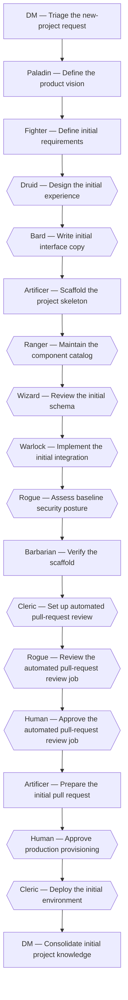

# Create a new project

*Canonical workflow id: `create-new-project`*

Source of truth: [`workflow.yaml`](workflow.yaml) (schema `guild.workflow/v1`).
See [`../EXECUTION_MODES.md`](../EXECUTION_MODES.md) for how this definition maps to a single
assistant switching roles, native subagents, or a future external runtime.

## Description

Bootstrap a brand-new project under Guild governance, from vision through an initial, verified, optionally-deployed skeleton.

## Languages and pull-request review come first

The triage step asks the human for three languages before any other question, and the
DM records them in `.guild/state/project.yaml`: the language Guild converses in, the
language the project's state prose is written in, and the language of its git history
(commits, pull requests, review comments). Each is asked as options plus free text;
until they are answered the DM speaks in the language the request was written in. Every
later step reads them from `project.yaml` — see `GUILD_MASTER_SPEC.md` section 3.2.

Right after the languages, the DM asks whether the Barbarian and/or the Rogue should also
run automatically on every pull request as a CI job on the repository host (a GitHub
Actions workflow on GitHub), and which agent client runs them. When at least one is
chosen, the Cleric writes the job, the Rogue reviews it and the human approves its secret
and its cost before it is enabled. The job only comments, and every comment with findings ends with a recommended prompt
the author can use to resolve them; it never stands in for a gate
— see `GUILD_MASTER_SPEC.md` section 11.4.

## Diagram

Diamond-shaped nodes are optional/conditional steps; see the step table for their condition.

```mermaid
flowchart TD
    new-project-01-triage["DM — Triage the new-project request"]
    new-project-02-define-vision["Paladin — Define the product vision"]
    new-project-03-define-requirements["Fighter — Define initial requirements"]
    new-project-04-design-experience{{"Druid — Design the initial experience"}}
    new-project-05-write-copy{{"Bard — Write initial interface copy"}}
    new-project-06-scaffold-project["Artificer — Scaffold the project skeleton"]
    new-project-07-maintain-component-catalog{{"Ranger — Maintain the component catalog"}}
    new-project-08-review-schema{{"Wizard — Review the initial schema"}}
    new-project-09-implement-integration{{"Warlock — Implement the initial integration"}}
    new-project-10-baseline-threat-model{{"Rogue — Assess baseline security posture"}}
    new-project-11-regression-review["Barbarian — Verify the scaffold"]
    new-project-12-set-up-pr-review-automation{{"Cleric — Set up automated pull-request review"}}
    new-project-13-review-pr-review-automation{{"Rogue — Review the automated pull-request review job"}}
    new-project-14-human-approval-pr-review-automation{{"Human — Approve the automated pull-request review job"}}
    new-project-15-prepare-pull-request["Artificer — Prepare the initial pull request"]
    new-project-16-human-approval-provision{{"Human — Approve production provisioning"}}
    new-project-17-initial-deployment{{"Cleric — Deploy the initial environment"}}
    new-project-18-consolidate-knowledge["DM — Consolidate initial project knowledge"]
    new-project-01-triage --> new-project-02-define-vision
    new-project-02-define-vision --> new-project-03-define-requirements
    new-project-03-define-requirements --> new-project-04-design-experience
    new-project-04-design-experience --> new-project-05-write-copy
    new-project-05-write-copy --> new-project-06-scaffold-project
    new-project-06-scaffold-project --> new-project-07-maintain-component-catalog
    new-project-07-maintain-component-catalog --> new-project-08-review-schema
    new-project-08-review-schema --> new-project-09-implement-integration
    new-project-09-implement-integration --> new-project-10-baseline-threat-model
    new-project-10-baseline-threat-model --> new-project-11-regression-review
    new-project-11-regression-review --> new-project-12-set-up-pr-review-automation
    new-project-12-set-up-pr-review-automation --> new-project-13-review-pr-review-automation
    new-project-13-review-pr-review-automation --> new-project-14-human-approval-pr-review-automation
    new-project-14-human-approval-pr-review-automation --> new-project-15-prepare-pull-request
    new-project-15-prepare-pull-request --> new-project-16-human-approval-provision
    new-project-16-human-approval-provision --> new-project-17-initial-deployment
    new-project-17-initial-deployment --> new-project-18-consolidate-knowledge
```

## Step protocol

Every step below follows the same protocol, whichever profile runs it
(`GUILD_MASTER_SPEC.md` sections 7, 8.1 and 11.2):

| When | Skill | What the responsible profile does |
|---|---|---|
| Before the step's own work | `claim-ownership` | Claims — or confirms — the area of the project this step touches, records it in its own ledger, and hands the claim to the DM (workflow-knowledge-orchestrator) for the ownership map. Work belonging to another profile's area goes back to the DM to route. |
| After the step's own work | `record-profile-knowledge` | Appends what this step verified to its own ledger with evidence, raises what it could not resolve as an open question, and hands the DM the entry ids — pointers, not copies. |
| When a step needs a decision no profile can make | `request-human-decision` | Raises it as a decision request with options, a recommendation and a stated default, and the DM presents it to the human. The step never proceeds on an assumption, and never on a default the human has not been shown. |
| When a step finds work it is not going to do | `record-technical-debt` | Records the change as a technical-debt work item in `.guild/state/planning/project-plan.yaml` — with an origin, evidence and the owner of the area it was found in — unscheduled until the Paladin (`product-owner`) prioritizes it. It never stays a `TODO` comment or a line in a summary, and recording it never enlarges the current step. |

This is why the DM can sequence the steps below without holding what each profile
knows: it routes by the ownership map, follows a pointer only when a decision needs
that detail, and puts what nobody can decide from the project itself to a person
rather than letting it stall — and why nothing a step noticed on the way is lost:
what it found but did not do is in the plan, owned, rather than in a comment.

## Steps

| Step id | Name | Responsible profile | Invoked skill | Gates |
|---|---|---|---|---|
| `new-project-01-triage` | Triage the new-project request | **DM** (`workflow-knowledge-orchestrator`) | `triage-request` | — |
| `new-project-02-define-vision` | Define the product vision | **Paladin** (`product-owner`) | `define-product-vision` | — |
| `new-project-03-define-requirements` | Define initial requirements | **Fighter** (`business-analyst`) | `define-requirements` | — |
| `new-project-04-design-experience` | Design the initial experience *(optional — when the new project has a user-facing interface)* | **Druid** (`product-experience-designer`) | `design-experience` | — |
| `new-project-05-write-copy` | Write initial interface copy *(optional — when the new project has a user-facing interface)* | **Bard** (`ux-content-designer`) | `write-interface-copy` | — |
| `new-project-06-scaffold-project` | Scaffold the project skeleton | **Artificer** (`product-software-engineer`) | `implement-feature` | — |
| `new-project-07-maintain-component-catalog` | Maintain the component catalog *(optional — when the interface includes reusable UI components worth developing, reviewing or visually verifying independently of the full application)* | **Ranger** (`web-experience-engineer`) | `maintain-component-catalog` | — |
| `new-project-08-review-schema` | Review the initial schema *(optional — when the new project requires a persistent data store)* | **Wizard** (`database-engineer`) | `review-schema-change` | — |
| `new-project-09-implement-integration` | Implement the initial integration *(optional — when the new project requires an external API/service integration from day one)* | **Warlock** (`integration-engineer`) | `implement-integration` | — |
| `new-project-10-baseline-threat-model` | Assess baseline security posture *(optional — when the project will handle authentication, payments, secrets or personal data)* | **Rogue** (`product-security-engineer`) | `create-threat-model` | — |
| `new-project-11-regression-review` | Verify the scaffold | **Barbarian** (`quality-assurance-engineer`) | `run-regression-review` | qa_gate_pass |
| `new-project-12-set-up-pr-review-automation` | Set up automated pull-request review *(optional — when the human chose the Barbarian and/or the Rogue for automated pull-request review in `new-project-01-triage`)* | **Cleric** (`cloud-devops-engineer`) | `set-up-pull-request-review-automation` | — |
| `new-project-13-review-pr-review-automation` | Review the automated pull-request review job *(optional — when the human chose the Barbarian and/or the Rogue for automated pull-request review in `new-project-01-triage`)* | **Rogue** (`product-security-engineer`) | `create-threat-model` | — |
| `new-project-14-human-approval-pr-review-automation` | Approve the automated pull-request review job *(optional — when the human chose the Barbarian and/or the Rogue for automated pull-request review in `new-project-01-triage`)* | **Human** | `grant-human-approval` | access_or_change_secrets, provision_material_cost |
| `new-project-15-prepare-pull-request` | Prepare the initial pull request | **Artificer** (`product-software-engineer`) | `prepare-pull-request` | — |
| `new-project-16-human-approval-provision` | Approve production provisioning *(optional — when this workflow provisions production infrastructure or deploys the new project to production)* | **Human** | `grant-human-approval` | deploy_production, provision_material_cost |
| `new-project-17-initial-deployment` | Deploy the initial environment *(optional — when this workflow includes provisioning a live environment)* | **Cleric** (`cloud-devops-engineer`) | `plan-and-execute-deployment` | — |
| `new-project-18-consolidate-knowledge` | Consolidate initial project knowledge | **DM** (`workflow-knowledge-orchestrator`) | `consolidate-knowledge` | — |

## Failure paths

- If the human rejects the automated pull-request review job, it is removed rather than left disabled, and the DM records the rejection and sets the recorded choice back to no profiles.
- A deployment that fails or regresses is rolled back by the Cleric (cloud-devops-engineer) using the rollback-deployment skill and its documented rollback path; the change does not stay live while the cause is investigated.
- If the scaffold fails verification, the workflow returns to scaffolding rather than proceeding to deployment.
- If a required human approval is denied, the workflow stops before the gated action and the DM records why, naming the profile that stays blocked.

## Return paths

- Findings from the Rogue on the automated pull-request review job return to the Cleric before the human approval is requested.
- A requirement built on an undocumented assumption returns to the Paladin for vision or the Fighter for requirements definition.

## Escalation paths

- Any production provisioning or deployment escalates to the human before execution, asked by the DM on the Cleric's behalf.
