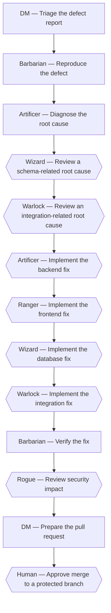

# Fix a bug

*Canonical workflow id: `fix-bug`*

Source of truth: [`workflow.yaml`](workflow.yaml) (schema `guild.workflow/v1`).
See [`../EXECUTION_MODES.md`](../EXECUTION_MODES.md) for how this definition maps to a single
assistant switching roles, native subagents, or a future external runtime.

## Description

Intake by the DM, reproduction by QA, root-cause and plan by the Product Software Engineer, specialist review when needed, implementation by the relevant specialist, regression validation by QA, conditional review by security, and pull-request preparation by the DM.

## Diagram

Diamond-shaped nodes are optional/conditional steps; see the step table for their condition.

## Steps

| Step id | Name | Responsible profile | Invoked skill | Gates |
|---|---|---|---|---|
| `fix-bug-01-triage` | Triage the defect report | **DM** (`workflow-knowledge-orchestrator`) | `triage-request` | — |
| `fix-bug-02-reproduce` | Reproduce the defect | **Barbarian** (`quality-assurance-engineer`) | `reproduce-defect` | — |
| `fix-bug-03-diagnose-root-cause` | Diagnose the root cause | **Artificer** (`product-software-engineer`) | `diagnose-root-cause` | — |
| `fix-bug-04-review-schema` | Review a schema-related root cause *(optional — when the root cause is in the database schema or a migration)* | **Wizard** (`database-engineer`) | `review-schema-change` | — |
| `fix-bug-05-review-integration` | Review an integration-related root cause *(optional — when the root cause is in an external integration)* | **Warlock** (`integration-engineer`) | `implement-integration` | — |
| `fix-bug-06-implement-fix-backend` | Implement the backend fix *(optional — when the root cause is in backend/domain logic)* | **Artificer** (`product-software-engineer`) | `implement-fix` | — |
| `fix-bug-07-implement-fix-frontend` | Implement the frontend fix *(optional — when the root cause is in the web-experience/frontend layer)* | **Ranger** (`web-experience-engineer`) | `implement-fix` | — |
| `fix-bug-08-implement-fix-database` | Implement the database fix *(optional — when the root cause requires a schema or data fix)* | **Wizard** (`database-engineer`) | `implement-fix` | — |
| `fix-bug-09-implement-fix-integration` | Implement the integration fix *(optional — when the root cause requires an integration fix)* | **Warlock** (`integration-engineer`) | `implement-fix` | — |
| `fix-bug-10-regression-review` | Verify the fix | **Barbarian** (`quality-assurance-engineer`) | `run-regression-review` | qa_gate_pass |
| `fix-bug-11-threat-model` | Review security impact *(optional — when the defect is security-relevant (authentication, authorization, injection, data exposure or secret handling))* | **Rogue** (`product-security-engineer`) | `create-threat-model` | security_gate_clean |
| `fix-bug-12-prepare-pull-request` | Prepare the pull request | **DM** (`workflow-knowledge-orchestrator`) | `prepare-pull-request` | — |
| `fix-bug-13-human-approval-merge` | Approve merge to a protected branch *(optional — when the target branch is protected)* | **Human** | `grant-human-approval` | merge_protected_branch |

## Failure paths

- An unreproducible defect halts the workflow at the Barbarian's reproduction step and escalates to the DM and the requester for more information.
- A failing regression review by the Barbarian returns to the implementing profile rather than proceeding to pull-request preparation.

## Return paths

- An inconclusive root-cause analysis returns to the Barbarian's reproduction step for a narrower repro.

## Escalation paths

- An open critical/high finding raised by the Rogue blocks pull-request preparation until resolved and re-reviewed.
- Merging to a protected branch always escalates to the human, asked by the DM in the approval-request format and naming the profile blocked on the answer.
