# Improve the product

*Canonical workflow id: `improve-product`*

Source of truth: [`workflow.yaml`](workflow.yaml) (schema `guild.workflow/v1`).
See [`../EXECUTION_MODES.md`](../EXECUTION_MODES.md) for how this definition maps to a single
assistant switching roles, native subagents, or a future external runtime.

## Description

A data-driven improvement cycle: evidence, hypothesis, prioritization, implementation, verification and outcome measurement, closing the loop back to evidence.

## Diagram

Diamond-shaped nodes are optional/conditional steps; see the step table for their condition.

```mermaid
flowchart TD
    improve-product-01-triage["Triage the improvement request"]
    improve-product-02-analyze-data["Analyze product data"]
    improve-product-03-evaluate-hypothesis["Evaluate the hypothesis against product vision"]
    improve-product-04-define-requirements["Define requirements"]
    improve-product-05-design-experience{{"Design the experience"}}
    improve-product-06-write-copy{{"Write interface copy"}}
    improve-product-07-implement-backend{{"Implement backend/domain logic"}}
    improve-product-08-implement-frontend{{"Implement the web experience"}}
    improve-product-09-review-schema{{"Review the schema change"}}
    improve-product-10-implement-integration{{"Implement the integration change"}}
    improve-product-11-instrument-analytics{{"Instrument analytics for the outcome measurement"}}
    improve-product-12-regression-review["Run the regression review"]
    improve-product-13-threat-model{{"Review security impact"}}
    improve-product-14-prepare-pull-request["Prepare the pull request"]
    improve-product-15-human-approval-merge{{"Approve merge to a protected branch"}}
    improve-product-16-human-approval-deploy{{"Approve production deployment"}}
    improve-product-17-deploy{{"Deploy the change"}}
    improve-product-18-evaluate-outcome["Evaluate the outcome"]
    improve-product-19-consolidate-knowledge["Consolidate knowledge"]
    improve-product-01-triage --> improve-product-02-analyze-data
    improve-product-02-analyze-data --> improve-product-03-evaluate-hypothesis
    improve-product-03-evaluate-hypothesis --> improve-product-04-define-requirements
    improve-product-04-define-requirements --> improve-product-05-design-experience
    improve-product-05-design-experience --> improve-product-06-write-copy
    improve-product-06-write-copy --> improve-product-07-implement-backend
    improve-product-07-implement-backend --> improve-product-08-implement-frontend
    improve-product-08-implement-frontend --> improve-product-09-review-schema
    improve-product-09-review-schema --> improve-product-10-implement-integration
    improve-product-10-implement-integration --> improve-product-11-instrument-analytics
    improve-product-11-instrument-analytics --> improve-product-12-regression-review
    improve-product-12-regression-review --> improve-product-13-threat-model
    improve-product-13-threat-model --> improve-product-14-prepare-pull-request
    improve-product-14-prepare-pull-request --> improve-product-15-human-approval-merge
    improve-product-15-human-approval-merge --> improve-product-16-human-approval-deploy
    improve-product-16-human-approval-deploy --> improve-product-17-deploy
    improve-product-17-deploy --> improve-product-18-evaluate-outcome
    improve-product-18-evaluate-outcome --> improve-product-19-consolidate-knowledge
```

## Steps

| Step id | Name | Responsible profile | Invoked skill | Gates |
|---|---|---|---|---|
| `improve-product-01-triage` | Triage the improvement request | workflow-knowledge-orchestrator | `triage-request` | — |
| `improve-product-02-analyze-data` | Analyze product data | product-data-analyst | `analyze-product-data` | — |
| `improve-product-03-evaluate-hypothesis` | Evaluate the hypothesis against product vision | product-owner | `define-product-vision` | — |
| `improve-product-04-define-requirements` | Define requirements | business-analyst | `define-requirements` | — |
| `improve-product-05-design-experience` | Design the experience *(optional — when the change has a user-facing interface)* | product-experience-designer | `design-experience` | — |
| `improve-product-06-write-copy` | Write interface copy *(optional — when the change has a user-facing interface)* | ux-content-designer | `write-interface-copy` | — |
| `improve-product-07-implement-backend` | Implement backend/domain logic *(optional — when the change touches domain logic, application flow or an API)* | product-software-engineer | `implement-feature` | — |
| `improve-product-08-implement-frontend` | Implement the web experience *(optional — when the change is primarily a web-experience/frontend change)* | web-experience-engineer | `implement-feature` | — |
| `improve-product-09-review-schema` | Review the schema change *(optional — when the change touches the database schema)* | database-engineer | `review-schema-change` | — |
| `improve-product-10-implement-integration` | Implement the integration change *(optional — when the change touches an external integration)* | integration-engineer | `implement-integration` | — |
| `improve-product-11-instrument-analytics` | Instrument analytics for the outcome measurement *(optional — when measuring the outcome requires new or changed analytics events)* | data-analytics-engineer | `instrument-analytics` | — |
| `improve-product-12-regression-review` | Run the regression review | quality-assurance-engineer | `run-regression-review` | qa_gate_pass |
| `improve-product-13-threat-model` | Review security impact *(optional — when the change touches authentication, authorization, secrets, payments or personal data)* | product-security-engineer | `create-threat-model` | security_gate_clean |
| `improve-product-14-prepare-pull-request` | Prepare the pull request | product-software-engineer | `prepare-pull-request` | — |
| `improve-product-15-human-approval-merge` | Approve merge to a protected branch *(optional — when the target branch is protected)* | human | `grant-human-approval` | merge_protected_branch |
| `improve-product-16-human-approval-deploy` | Approve production deployment *(optional — when this workflow includes a production deployment)* | human | `grant-human-approval` | deploy_production |
| `improve-product-17-deploy` | Deploy the change *(optional — when this workflow includes a deployment)* | cloud-devops-engineer | `plan-and-execute-deployment` | — |
| `improve-product-18-evaluate-outcome` | Evaluate the outcome | product-data-analyst | `analyze-product-data` | — |
| `improve-product-19-consolidate-knowledge` | Consolidate knowledge | workflow-knowledge-orchestrator | `consolidate-knowledge` | — |

## Failure paths

- A failing regression review returns to the implementing step rather than proceeding to review or deployment.
- An open critical/high security finding blocks pull-request preparation until resolved and re-reviewed.

## Return paths

- If the Product Manager rejects the hypothesis at improve-product-03-evaluate-hypothesis, the workflow ends there without implementation — a valid negative decision, not a failure.
- An inconclusive or negative outcome at improve-product-18-evaluate-outcome returns to analysis or escalates to the Product Manager for a scope decision.

## Escalation paths

- Merging to a protected branch and any production deployment always escalate to the human before proceeding.
