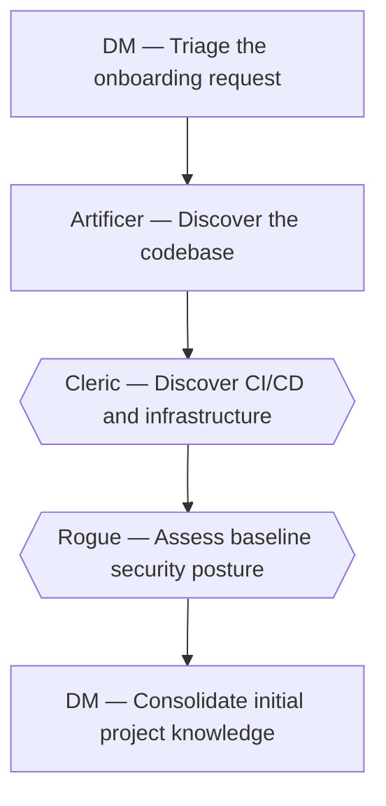

# Onboard an existing project

*Canonical workflow id: `onboard-existing-project`*

Source of truth: [`workflow.yaml`](workflow.yaml) (schema `guild.workflow/v1`).
See [`../EXECUTION_MODES.md`](../EXECUTION_MODES.md) for how this definition maps to a single
assistant switching roles, native subagents, or a future external runtime.

## Description

Bring an existing repository under Guild governance: discover its stack, structure and conventions, establish a baseline security posture, and initialize planning and project memory from verified evidence. Read-only against the target codebase; makes no product change.

## Diagram

Diamond-shaped nodes are optional/conditional steps; see the step table for their condition.

## Step protocol

Every step below follows the same protocol, whichever profile runs it
(`GUILD_MASTER_SPEC.md` sections 7 and 11.2):

| When | Skill | What the responsible profile does |
|---|---|---|
| Before the step's own work | `claim-ownership` | Claims — or confirms — the area of the project this step touches, records it in its own ledger, and hands the claim to the DM (workflow-knowledge-orchestrator) for the ownership map. Work belonging to another profile's area goes back to the DM to route. |
| After the step's own work | `record-profile-knowledge` | Appends what this step verified to its own ledger with evidence, raises what it could not resolve as an open question, and hands the DM the entry ids — pointers, not copies. |
| When a step needs a decision no profile can make | `request-human-decision` | Raises it as a decision request with options, a recommendation and a stated default, and the DM presents it to the human. The step never proceeds on an assumption, and never on a default the human has not been shown. |

This is why the DM can sequence the steps below without holding what each profile
knows: it routes by the ownership map, follows a pointer only when a decision needs
that detail, and puts what nobody can decide from the project itself to a person
rather than letting it stall.

## Steps

| Step id | Name | Responsible profile | Invoked skill | Gates |
|---|---|---|---|---|
| `onboard-01-triage` | Triage the onboarding request | **DM** (`workflow-knowledge-orchestrator`) | `triage-request` | — |
| `onboard-02-discover-codebase` | Discover the codebase | **Artificer** (`product-software-engineer`) | `discover-project` | discovery_report_evidence_backed |
| `onboard-03-discover-infra` | Discover CI/CD and infrastructure *(optional — when the repository includes CI/CD pipelines or infrastructure-as-code configuration)* | **Cleric** (`cloud-devops-engineer`) | `discover-project` | — |
| `onboard-04-baseline-threat-model` | Assess baseline security posture *(optional — when discovery finds authentication, payment, secret-handling or personal-data code)* | **Rogue** (`product-security-engineer`) | `create-threat-model` | — |
| `onboard-05-consolidate-knowledge` | Consolidate initial project knowledge | **DM** (`workflow-knowledge-orchestrator`) | `consolidate-knowledge` | memory_entries_evidence_backed |

## Failure paths

- If the repository cannot be read or access is denied, the workflow halts at triage and the DM escalates to the human, naming the access it needs.
- If discovery evidence is insufficient to support an evidence-backed memory entry, the entry is left unrecorded rather than guessed.

## Return paths

- Ambiguous or contradictory discovery findings return to the Artificer or the Cleric for a narrower discovery scope.

## Escalation paths

- A baseline security finding of critical or high severity from the Rogue escalates directly to the human, bypassing the rest of the sequence.
