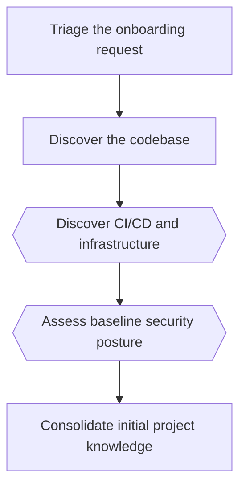

# Onboard an existing project

*Canonical workflow id: `onboard-existing-project`*

Source of truth: [`workflow.yaml`](workflow.yaml) (schema `guild.workflow/v1`).
See [`../EXECUTION_MODES.md`](../EXECUTION_MODES.md) for how this definition maps to a single
assistant switching roles, native subagents, or a future external runtime.

## Description

Bring an existing repository under Guild governance: discover its stack, structure and conventions, establish a baseline security posture, and initialize planning and project memory from verified evidence. Read-only against the target codebase; makes no product change.

## Diagram

Diamond-shaped nodes are optional/conditional steps; see the step table for their condition.

## Steps

| Step id | Name | Responsible profile | Invoked skill | Gates |
|---|---|---|---|---|
| `onboard-01-triage` | Triage the onboarding request | workflow-knowledge-orchestrator | `triage-request` | — |
| `onboard-02-discover-codebase` | Discover the codebase | product-software-engineer | `discover-project` | discovery_report_evidence_backed |
| `onboard-03-discover-infra` | Discover CI/CD and infrastructure *(optional — when the repository includes CI/CD pipelines or infrastructure-as-code configuration)* | cloud-devops-engineer | `discover-project` | — |
| `onboard-04-baseline-threat-model` | Assess baseline security posture *(optional — when discovery finds authentication, payment, secret-handling or personal-data code)* | product-security-engineer | `create-threat-model` | — |
| `onboard-05-consolidate-knowledge` | Consolidate initial project knowledge | workflow-knowledge-orchestrator | `consolidate-knowledge` | memory_entries_evidence_backed |

## Failure paths

- If the repository cannot be read or access is denied, the workflow halts at triage and escalates to the human.
- If discovery evidence is insufficient to support an evidence-backed memory entry, the entry is left unrecorded rather than guessed.

## Return paths

- Ambiguous or contradictory discovery findings return to the discovery step with a narrower scope.

## Escalation paths

- A baseline security finding of critical or high severity escalates directly to the human, bypassing the rest of the sequence.
