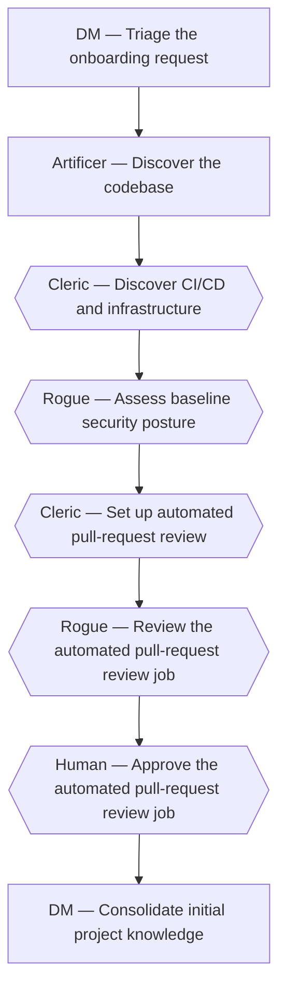

# Onboard an existing project

*Canonical workflow id: `onboard-existing-project`*

Source of truth: [`workflow.yaml`](workflow.yaml) (schema `guild.workflow/v1`).
See [`../EXECUTION_MODES.md`](../EXECUTION_MODES.md) for how this definition maps to a single
assistant switching roles, native subagents, or a future external runtime.

## Description

Bring an existing repository under Guild governance: discover its stack, structure and conventions, establish a baseline security posture, and initialize planning and project memory from verified evidence. Read-only against the target codebase and makes no product change; the one file it may add is the automated pull-request review CI job, when the human chooses one.

## Languages and pull-request review come first

The triage step asks the human for three languages before any other question, and the
DM records them in `.guild/state/project.yaml`: the language Guild converses in, the
language the project's state prose is written in, and the language of its git history
(commits, pull requests, review comments). Each is asked as options plus free text;
until they are answered the DM speaks in the language the request was written in. Every
later step reads them from `project.yaml` — see `GUILD_MASTER_SPEC.md` section 3.2.

Right after the languages, the DM asks whether the Barbarian and/or the Rogue should also
run automatically on every pull request as a CI job on the repository host (a GitHub
Actions workflow on GitHub), and which agent client runs them. When at least one is
chosen, the Cleric writes the job, the Rogue reviews it and the human approves its secret
and its cost before it is enabled. The job only comments, and every comment with findings ends with a recommended prompt
the author can use to resolve them; it never stands in for a gate
— see `GUILD_MASTER_SPEC.md` section 11.4.

## Diagram

Diamond-shaped nodes are optional/conditional steps; see the step table for their condition.

```mermaid
flowchart TD
    onboard-01-triage["DM — Triage the onboarding request"]
    onboard-02-discover-codebase["Artificer — Discover the codebase"]
    onboard-03-discover-infra{{"Cleric — Discover CI/CD and infrastructure"}}
    onboard-04-baseline-threat-model{{"Rogue — Assess baseline security posture"}}
    onboard-05-set-up-pr-review-automation{{"Cleric — Set up automated pull-request review"}}
    onboard-06-review-pr-review-automation{{"Rogue — Review the automated pull-request review job"}}
    onboard-07-human-approval-pr-review-automation{{"Human — Approve the automated pull-request review job"}}
    onboard-08-consolidate-knowledge["DM — Consolidate initial project knowledge"]
    onboard-01-triage --> onboard-02-discover-codebase
    onboard-02-discover-codebase --> onboard-03-discover-infra
    onboard-03-discover-infra --> onboard-04-baseline-threat-model
    onboard-04-baseline-threat-model --> onboard-05-set-up-pr-review-automation
    onboard-05-set-up-pr-review-automation --> onboard-06-review-pr-review-automation
    onboard-06-review-pr-review-automation --> onboard-07-human-approval-pr-review-automation
    onboard-07-human-approval-pr-review-automation --> onboard-08-consolidate-knowledge
```

## Step protocol

Every step below follows the same protocol, whichever profile runs it
(`GUILD_MASTER_SPEC.md` sections 7, 8.1 and 11.2):

| When | Skill | What the responsible profile does |
|---|---|---|
| Before the step's own work | `claim-ownership` | Claims — or confirms — the area of the project this step touches, records it in its own ledger, and hands the claim to the DM (workflow-knowledge-orchestrator) for the ownership map. Work belonging to another profile's area goes back to the DM to route. |
| After the step's own work | `record-profile-knowledge` | Appends what this step verified to its own ledger with evidence, raises what it could not resolve as an open question, and hands the DM the entry ids — pointers, not copies. |
| When a step needs a decision no profile can make | `request-human-decision` | Raises it as a decision request with options, a recommendation and a stated default, and the DM presents it to the human. The step never proceeds on an assumption, and never on a default the human has not been shown. |
| When a step finds work it is not going to do | `record-technical-debt` | Records the change as a technical-debt work item in `.guild/state/planning/project-plan.yaml` — with an origin, evidence and the owner of the area it was found in — unscheduled until the Paladin (`product-owner`) prioritizes it. It never stays a `TODO` comment or a line in a summary, and recording it never enlarges the current step. |

This is why the DM can sequence the steps below without holding what each profile
knows: it routes by the ownership map, follows a pointer only when a decision needs
that detail, and puts what nobody can decide from the project itself to a person
rather than letting it stall — and why nothing a step noticed on the way is lost:
what it found but did not do is in the plan, owned, rather than in a comment.

## Steps

| Step id | Name | Responsible profile | Invoked skill | Gates |
|---|---|---|---|---|
| `onboard-01-triage` | Triage the onboarding request | **DM** (`workflow-knowledge-orchestrator`) | `triage-request` | — |
| `onboard-02-discover-codebase` | Discover the codebase | **Artificer** (`product-software-engineer`) | `discover-project` | discovery_report_evidence_backed |
| `onboard-03-discover-infra` | Discover CI/CD and infrastructure *(optional — when the repository includes CI/CD pipelines or infrastructure-as-code configuration)* | **Cleric** (`cloud-devops-engineer`) | `discover-project` | — |
| `onboard-04-baseline-threat-model` | Assess baseline security posture *(optional — when discovery finds authentication, payment, secret-handling or personal-data code)* | **Rogue** (`product-security-engineer`) | `create-threat-model` | — |
| `onboard-05-set-up-pr-review-automation` | Set up automated pull-request review *(optional — when the human chose the Barbarian and/or the Rogue for automated pull-request review in `onboard-01-triage`)* | **Cleric** (`cloud-devops-engineer`) | `set-up-pull-request-review-automation` | — |
| `onboard-06-review-pr-review-automation` | Review the automated pull-request review job *(optional — when the human chose the Barbarian and/or the Rogue for automated pull-request review in `onboard-01-triage`)* | **Rogue** (`product-security-engineer`) | `create-threat-model` | — |
| `onboard-07-human-approval-pr-review-automation` | Approve the automated pull-request review job *(optional — when the human chose the Barbarian and/or the Rogue for automated pull-request review in `onboard-01-triage`)* | **Human** | `grant-human-approval` | access_or_change_secrets, provision_material_cost |
| `onboard-08-consolidate-knowledge` | Consolidate initial project knowledge | **DM** (`workflow-knowledge-orchestrator`) | `consolidate-knowledge` | memory_entries_evidence_backed |

## Failure paths

- If the human rejects the automated pull-request review job, it is removed rather than left disabled, and the DM records the rejection and sets the recorded choice back to no profiles.
- If the repository cannot be read or access is denied, the workflow halts at triage and the DM escalates to the human, naming the access it needs.
- If discovery evidence is insufficient to support an evidence-backed memory entry, the entry is left unrecorded rather than guessed.

## Return paths

- Findings from the Rogue on the automated pull-request review job return to the Cleric before the human approval is requested.
- Ambiguous or contradictory discovery findings return to the Artificer or the Cleric for a narrower discovery scope.

## Escalation paths

- A baseline security finding of critical or high severity from the Rogue escalates directly to the human, bypassing the rest of the sequence.
