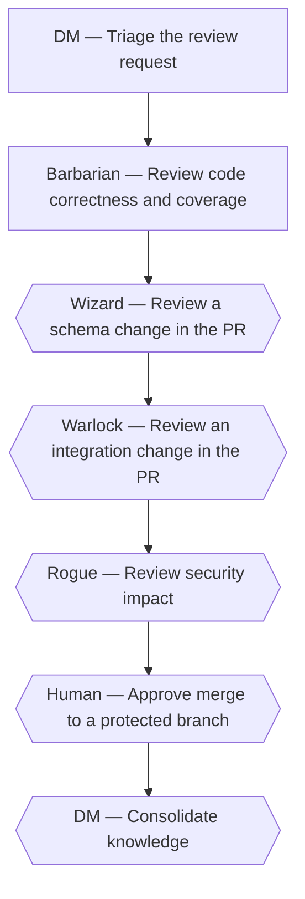

# Review a pull request

*Canonical workflow id: `review-pull-request`*

Source of truth: [`workflow.yaml`](workflow.yaml) (schema `guild.workflow/v1`).
See [`../EXECUTION_MODES.md`](../EXECUTION_MODES.md) for how this definition maps to a single
assistant switching roles, native subagents, or a future external runtime.

## Description

Independently review a pull request — whether produced by another Guild workflow or submitted directly — for correctness, schema/integration risk and security, with an explicit human approval point before any protected-branch merge.

## Diagram

Diamond-shaped nodes are optional/conditional steps; see the step table for their condition.

## Step protocol

Every step below follows the same protocol, whichever profile runs it
(`GUILD_MASTER_SPEC.md` sections 7 and 11.2):

| When | Skill | What the responsible profile does |
|---|---|---|
| Before the step's own work | `claim-ownership` | Claims — or confirms — the area of the project this step touches, records it in its own ledger, and hands the claim to the DM (workflow-knowledge-orchestrator) for the ownership map. Work belonging to another profile's area goes back to the DM to route. |
| After the step's own work | `record-profile-knowledge` | Appends what this step verified to its own ledger with evidence, raises what it could not resolve as an open question, and hands the DM the entry ids — pointers, not copies. |
| When a step needs a decision no profile can make | `request-human-decision` | Raises it as a decision request with options, a recommendation and a stated default, and the DM presents it to the human. The step never proceeds on an assumption, and never on a default the human has not been shown. |

This is why the DM can sequence the steps below without holding what each profile
knows: it routes by the ownership map, follows a pointer only when a decision needs
that detail, and puts what nobody can decide from the project itself to a person
rather than letting it stall.

## Steps

| Step id | Name | Responsible profile | Invoked skill | Gates |
|---|---|---|---|---|
| `review-pr-01-triage` | Triage the review request | **DM** (`workflow-knowledge-orchestrator`) | `triage-request` | — |
| `review-pr-02-review-code` | Review code correctness and coverage | **Barbarian** (`quality-assurance-engineer`) | `review-code` | qa_gate_pass |
| `review-pr-03-review-schema` | Review a schema change in the PR *(optional — when the pull request touches the database schema or a migration)* | **Wizard** (`database-engineer`) | `review-schema-change` | — |
| `review-pr-04-review-integration` | Review an integration change in the PR *(optional — when the pull request touches an external integration)* | **Warlock** (`integration-engineer`) | `implement-integration` | — |
| `review-pr-05-threat-model` | Review security impact *(optional — when the pull request touches a security-sensitive surface (authentication, authorization, secrets, payments or personal data))* | **Rogue** (`product-security-engineer`) | `create-threat-model` | security_gate_clean |
| `review-pr-06-human-approval-merge` | Approve merge to a protected branch *(optional — when the target branch is protected)* | **Human** | `grant-human-approval` | merge_protected_branch |
| `review-pr-07-consolidate-knowledge` | Consolidate knowledge *(optional — when the review surfaced a reusable pattern or decision)* | **DM** (`workflow-knowledge-orchestrator`) | `consolidate-knowledge` | — |

## Failure paths

- A failing code review by the Barbarian returns to the author with specific comments rather than proceeding toward merge.
- An open critical/high finding raised by the Rogue blocks merge approval until resolved and re-reviewed.

## Return paths

- Review comments that require rework return to the author (via the DM when the author is external to Guild).

## Escalation paths

- Merging to a protected branch always escalates to the human, asked by the DM in the approval-request format and naming the profile blocked on the answer.
